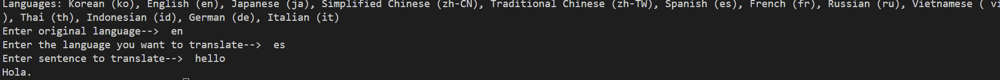

# translater

terminal ver

web ver

## how i made this

I use [papago](https://papago.naver.com/) api for translate.

You can visit [naver developer website](https://developers.naver.com/main/) and get api.

## copyright

Copyright by &copy; by @lamonlemon(jaewon song) 
All Right Reserves 